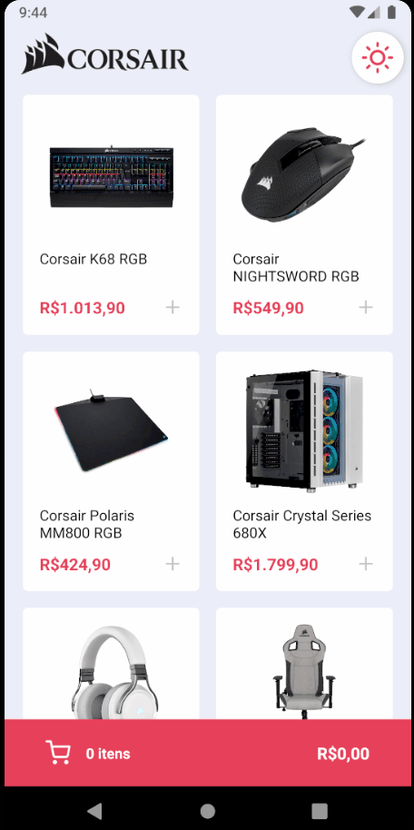

<h1 align="center">
 
  
  
 
 
Corsair Marketplace
</h1>

Application of a Corsair Marketplace, with some of its products, so that the user can add to the cart.

  

## 🚀 Technologies

This project was developed with the following technologies:

- ✔️ Typescript

- ✔️ React Native

- ✔️ Context API

- ✔️ React Hooks

- ✔️ Styled-components

- ✔️ Axios

- ✔️ Json-server

Made with ♥ by ARTHUR PC :wave: [Get in touch!](https://www.linkedin.com/in/arthurpc03/)
